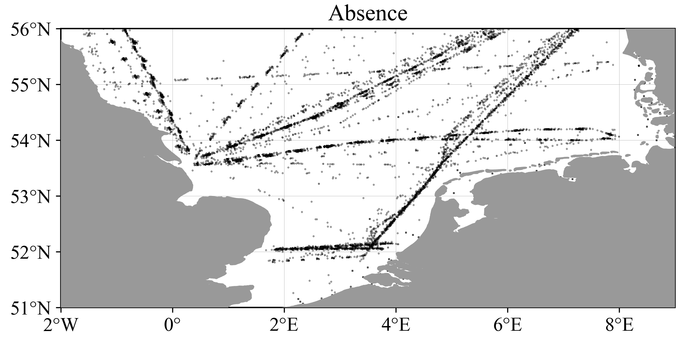
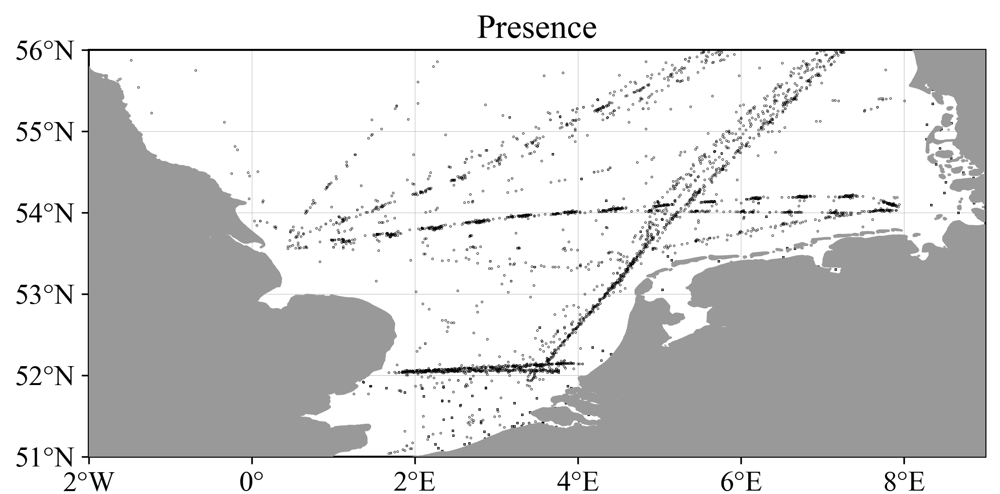
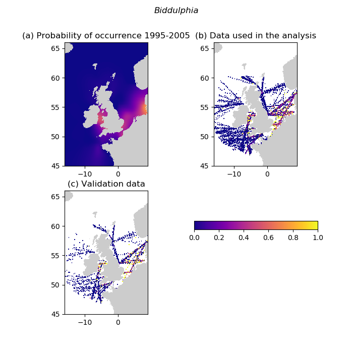

# EMODnet-Biology-Phytoplankton-Interpolation


DIVA (Data Interpolating Variational Analysis) and DIVAnd (DIVA in n dimensions) are software tools primarily designed to generate gridded maps of continuous variables such as sea water temperature, salinity or oxygen concentration. The main advantages over other interpolation or analysis method are:
* coastlines and physical boundaries are taken into account by the method.
* large datasets (million of data points) can be ingested and processed by the tool.

DIVAnd is a multi-dimensional generalization ([Barth et al., 2014](https://dx.doi.org/10.5194/gmd-7-225-2014)), written in the [Julia language](https://julialang.org/), with a new mathematical formulation with respect to the previous DIVA code.

## DIVAnd for presence/absence data

The dataset to be processed contained only a binary information: presence or absence, and the objective is to derive a map showing the probability to encounter a given species, as illustrated below for Biddulphia sinensis. Both the presence and absence observations follow ship tracks most of the time, resulting in an uneven data distribution across the domain of interest.





This directory provides the code for the reading of data files and performing spatial interpolation using `DIVAnd` software tool.

* [Heatmap](https://github.com/gher-ulg/EMODnet-Biology-Interpolated-Maps/blob/master/analysis/interp_presence_absence.ipynb) [](https://mybinder.org/v2/gh/gher-ulg/EMODnet-Biology-Interpolated-Maps/master?filepath=analysis%2Finterp_presence_absence.ipynb)
* [Neural network](https://github.com/gher-ulg/EMODnet-Biology-Interpolated-Maps/blob/master/analysis/emodnet_bio_DIVAndNN.ipynb) (binder does only provide 2GB of memory which is insufficient for this notebook)


## Directory structure

```
{{EMODnet-Biology-Interpolated-Maps}}/
├── analysis
├── data/
├── docs/
├── product/
│   ├── figures/
│   ├── netCDF/
│   └── parameters/
└── scripts/
```

* **analysis** - Jupyter notebooks used to perform the data analysis, create the figures and the `netCDF` files.
* **data** - contains a text file with the URLs of the data files.
* **docs** - Rendered reports
* **product** - Output product files: `netCDF` containing the gridded, probability fields and the corresponding figures in `PNG` format.
* **scripts** - Reusable code: functions employed in the Jupyter notebooks.

## Data

Data files have been produced by Deltares (Luuk van der Heijden, Willem Stolte).
They consist of `CSV` files containing the dates, coordinates and occurrences (presence of absence) of 200 species in the North Sea.
The content of a data file looks like this (example for `Gymnodinium-1995-2020.csv`):
```bash
"abbr","date_year","genus","date_xUTM_yUTM","date","xUTM","yUTM","season","eventID","wint_year","occurs","gridnr","middleXgrid","middleYgrid"
"dome-phytoplankton",2010,"Gymnodinium","2010-01-11_477850.085718031_5756212.06783869",2010-01-11,477850.085718031,5756212.06783869,"winter",NA,NA,0,201,472500,5752500
"dome-phytoplankton",2010,"Gymnodinium","2010-01-11_560048.806065514_5746827.70084791",2010-01-11,560048.806065514,5746827.70084791,"winter",NA,NA,0,207,562500,5752500
"dome-phytoplankton",2010,"Gymnodinium","2010-01-11_563052.641129395_5744324.75671705",2010-01-11,563052.641129395,5744324.75671705,"winter",NA,NA,0,174,562500,5737500
"dome-phytoplankton",2010,"Gymnodinium","2010-01-11_742467.610873757_5940711.86346217",2010-01-11,742467.610873757,5940711.86346217,"winter",NA,NA,0,648,742500,5947500
```

The absence/presence CSV files from https://github.com/EMODnet/EMODnet-Biology-Phytoplankton-Greater-NorthSea should be placed in the directory `data/raw_data/CSV` (e.g. `data/raw_data/CSV/Gymnodinium-1995-2020.csv`). The data will be split automatically by the script `scripts/emodnet_bio2020.jl` into training data and validation data.


## Installation

The code uses Julia 1.5 (available from https://julialang.org/downloads/). The necessary julia packages to run the analysis `emodnet_bio2020.jl`
can be installed by using the following commands in a julia session:

``` julia
using Pkg
cd("/full/path/to/local/repository")
Pkg.activate(".")
Pkg.instantiate()
```

where `/full/path/to/local/repository` is the file path containing the source code of this repository and in particular the files
`Manifest.toml` and `Project.toml`. More information about Julia environements is availabe [here](https://pkgdocs.julialang.org/v1/environments/).

## Analysis

This directory contains the notebooks for the preparation and analysis of the data.

* `scripts/emodnet_bio2020.jl`: compute the probability map of phytoplankton in the North Sea using `DIVAnd` and a neural network.
* `heatmap_testcase.ipynb`: several simple test cases to illustrate how the probability is derived from heatmaps.
* `interp_presence_absence.ipynb`: documented application showing the interpolation of a single species: _Biddulphia Sinensis_.
* `interp_presence_absence_prod.ipynb`

* `plot_data_histograms.ipynb`
* `plot_validationscore_L.ipynb`


The results will be written to the directory `product`. The output path can be overwritten by setting the environment variable `DATADIR`.


### Neural network reconstruction

We applied a neural network technique that allows us to use other relevant co-variables to improve the gridded fields. The principle is to maximize the likelihood of a field given the training data. The environment variables considered in this exercise are:
* bathymetry (from GEBCO),
* silicate (from EMODnet Chemistry)
* phosphate (from EMODnet Chemistry)
* nitrate concentrations (from EMODnet Chemistry).

The derived probability is the logistic function of the output of a neural network (using the previous environmental variables) and a residue field. The residue field is constrained by the regularity constraint as implemented in DIVAnd.  Formally the derived probability p(x) is given by:

p(x)  =  logistic(f(v₁, v₂, … vₙ)  +  x’)

where logistic is the logistic function (logistic(x) = 1 / (1 + exp (-x))) , v₁, v₂, … vₙ are environmental variables related to the probability, f (v₁, v₂, … vₙ) is a neural network and x’ is a residue varying of a specified length-scale (using the constraint from DIVAnd).

The cost function is based on the negative log likelihood using the training data. The gradient of the cost function is computed using the automatic differentiation tools integrated in Knet.jl . The cost function is minimized in 500 iterations using the Adam optimizer.

The domain spans from 16 °W  to 9°E and from 45°N to 66°N with a resolution of 0.1°. We considered the year 1995, 2000, 2005, 2010 and 2015 with a temporal correlation length of 5 years. For example, the first time instance is thus an average over the years 1990 to 2000.

### Validation

The validation is carried out by taking out 20% of the initial dataset and then comparing the results at the locations where the data have been removed. The validations data points are selected in order to consider that several points are sampled multiple times. As a result, for each species we end up with 2 files: one for the analysis (80% of the data points) and one for the validation.
The validation score has to take into account that we are working with probabilities, not with a continuous variable. For this reason we used the log-likelihood, where we sum:

1. the logarithms of the predicted probabilities where the actual response was one
2. the logarithms of (1 - p) whenever the actual response was zero.

The lowest is the score, the best is the analysis. Thanks to the validation step, we can compare different parameters of the Neural Network (in particular the correlation length and the data constraint)  and get an overall appreciation of the quality of the analysis. The provided data product corresponds to the results with the lowest negative log-likelihood (or simply with the highest likelihood given the validation observations) .
The accuracy of the interpolated field depends strongly on the distribution of the data. Far from  observations the accuracy of the interpolated occurrence probability is much lower than close to the observations.




Neural network reconstruction with DIVAnd for Biddulphia. Panel (a) is the derived probability and (b) and (c) are occurrence data (absence is counted as 0 and presence counted as 1) averaged by unique stations for the training data and validation data respectively.

### Production

The procedure described in the previous sections has been applied to the 200 Phytoplankton species provided by Deltares. For each species, we have generated:
* NetCDF files containing the gridded fields
* A JSON file with the analysis parameters and the validation score (negative log-likelihood)

Preview figures in PNG format for the 5 time instances.

### Code

The code, written in Julia, is distributed through GitHub:
https://github.com/EMODnet/EMODnet-Biology-Phytoplankton-Interpolated-Maps .
The scripts directory contains the functions defined for the data processing.
The analysis directory stores different jupyter-notebooks describing the different analysis steps.
The package [gher-ulg/DIVAndNN.jl](https://github.com/gher-ulg/DIVAndNN.jl) is generic and not specific to the phytoplankton data in the North Sea. All code specific to this test case has been added to the repository [https://github.com/EMODnet/EMODnet-Biology-Phytoplankton-Interpolated-Maps](EMODnet/EMODnet-Biology-Phytoplankton-Interpolated-Maps).
The DIVAnd Neural Network has been prepared for Binder, including the declaration of all software and data dependencies. In Binder, only 2 GB of RAM are available per user which is insufficient to run this code.


## Citation

Please cite this product as:

*A. Barth, Willem Stolte, C. Troupin & Luuk van der Heijden (2020). Probability maps for different phytoplankton species in the North Sea. Integrated data products created under the European Marine Observation Data Network (EMODnet) Biology project (EASME/EMFF/2017/1.3.1.2/02/SI2.789013), funded by the by the European Union under Regulation (EU) No 508/2014 of the European Parliament and of the Council of 15 May 2014 on the European Maritime and Fisheries Fund*

The code is free software; you can redistribute it and/or modify it under the terms of the GNU General Public License as published by the Free Software Foundation; either version 2 of the License, or (at your option) any later version.

<!--  LocalWords:  EMODnet Phytoplankton Variational DIVAnd gridded
 -->
<!--  LocalWords:  datasets et al dataset Biddulphia sinensis Heatmap
 -->
<!--  LocalWords:  netCDF Jupyter PNG Deltares Luuk der Heijden CSV
 -->
<!--  LocalWords:  Willem Stolte Gymnodinium csv xUTM yUTM eventID jl
 -->
<!--  LocalWords:  wint gridnr middleXgrid middleYgrid phytoplankton
 -->
<!--  LocalWords:  heatmap testcase ipynb heatmaps interp DATADIR ulg
 -->
<!--  LocalWords:  validationscore bathymetry GEBCO Knet JSON toml
 -->
<!--  LocalWords:  else's jupyter gher Troupin
 -->
